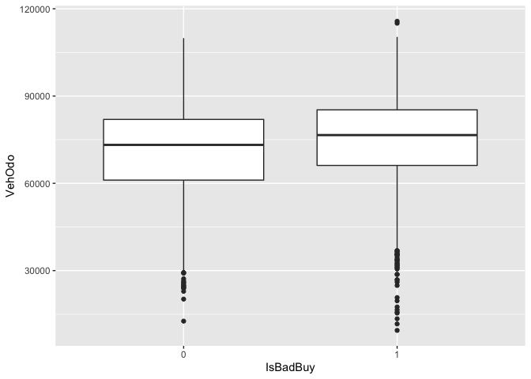
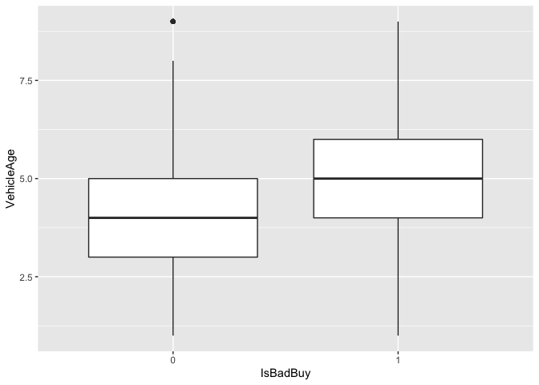

Car Sales Prediction
================

## Part 1: Data Preparation

1)  Setting the seed and partitioning the data. The proportion of
    observations in the training data set should be 70%. The remaining
    30% of observations should be in the test data set.

<!-- end list -->

``` r
#Setting the seed
set.seed(71923)

#Train Test Split
train_insts = sample(nrow(carDF), .7*nrow(carDF))
carDFTrain <- carDF[train_insts,]
carDFTest <- carDF[-train_insts,]
```

## Part 2: Exploratory Data Analysis

1)  Boxplots of VehOdo and VehicleAge (broken up by values of IsBadBuy).

<!-- end list -->

``` r
#Plotting the box plots
ggplot(carDFTrain, aes( x = IsBadBuy, y = VehOdo)) + geom_boxplot()
```

<!-- -->

``` r
ggplot(carDFTrain, aes(x = IsBadBuy, y = VehicleAge)) + geom_boxplot()
```

<!-- -->

We can see that bad buys have a higher vehicle age.

2)  Report a two-way table for count of IsBadBuy broken up by Make
    (i.e. what are the numbers of each make of cars that are good
    vs. bad buys?)

<!-- end list -->

``` r
#Two-way table 
table(carDFTrain$Make, carDFTrain$IsBadBuy)
```

    ##             
    ##                0   1
    ##   ACURA        2   4
    ##   BUICK       31  38
    ##   CADILLAC     0   2
    ##   CHEVROLET  826 623
    ##   CHRYSLER   425 430
    ##   DODGE      637 540
    ##   FORD       550 690
    ##   GMC         29  34
    ##   HONDA       31  27
    ##   HYUNDAI     75  77
    ##   INFINITI     2   5
    ##   ISUZU        7   4
    ##   JEEP        75  94
    ##   KIA        152 115
    ##   LEXUS        0   4
    ##   LINCOLN      5   8
    ##   MAZDA       52  64
    ##   MERCURY     46  65
    ##   MINI         3   4
    ##   MITSUBISHI  54  50
    ##   NISSAN      90 136
    ##   OLDSMOBILE   7  25
    ##   PLYMOUTH     0   1
    ##   PONTIAC    226 187
    ##   SATURN      98 116
    ##   SCION       10   6
    ##   SUBARU       1   2
    ##   SUZUKI      64  77
    ##   TOYOTA      50  51
    ##   VOLKSWAGEN   6   7
    ##   VOLVO        3   0

For Ford vehicles bad buys are really high than good buys. But we are
not really controlling for other variables hence cannot make a concrete
argument here.

## Part 3: Logistic Regression

1)  Training a logistic regression model of IsBadBuy on the demographic
    variables using the training data set.

<!-- end list -->

``` r
#Logistic Regression
RegressionPart4 <- glm(IsBadBuy ~ Auction + VehicleAge + Make +Color + 
                        WheelType + VehOdo + Size + MMRAcquisitionAuctionAveragePrice + 
                        MMRAcquisitionRetailAveragePrice, data = carDFTrain, family = "binomial")
summary(RegressionPart4)
```

    ## 
    ## Call:
    ## glm(formula = IsBadBuy ~ Auction + VehicleAge + Make + Color + 
    ##     WheelType + VehOdo + Size + MMRAcquisitionAuctionAveragePrice + 
    ##     MMRAcquisitionRetailAveragePrice, family = "binomial", data = carDFTrain)
    ## 
    ## Deviance Residuals: 
    ##     Min       1Q   Median       3Q      Max  
    ## -2.9194  -0.9712  -0.5640   1.0977   2.1419  
    ## 
    ## Coefficients:
    ##                                     Estimate Std. Error z value Pr(>|z|)    
    ## (Intercept)                       -2.182e+00  1.279e+00  -1.707  0.08785 .  
    ## AuctionMANHEIM                     2.017e-01  7.169e-02   2.813  0.00491 ** 
    ## AuctionOTHER                       1.285e-02  8.601e-02   0.149  0.88128    
    ## VehicleAge                         2.716e-01  2.745e-02   9.896  < 2e-16 ***
    ## MakeBUICK                          1.540e-01  9.669e-01   0.159  0.87348    
    ## MakeCADILLAC                       1.324e+01  3.013e+02   0.044  0.96495    
    ## MakeCHEVROLET                     -1.071e-01  9.334e-01  -0.115  0.90864    
    ## MakeCHRYSLER                       3.758e-01  9.319e-01   0.403  0.68678    
    ## MakeDODGE                          1.293e-01  9.304e-01   0.139  0.88951    
    ## MakeFORD                           2.647e-01  9.326e-01   0.284  0.77651    
    ## MakeGMC                            9.698e-03  9.704e-01   0.010  0.99203    
    ## MakeHONDA                         -3.037e-01  9.758e-01  -0.311  0.75562    
    ## MakeHYUNDAI                        7.513e-02  9.482e-01   0.079  0.93684    
    ## MakeINFINITI                       1.291e+00  1.337e+00   0.966  0.33418    
    ## MakeISUZU                         -8.300e-01  1.200e+00  -0.692  0.48902    
    ## MakeJEEP                           2.201e-01  9.512e-01   0.231  0.81703    
    ## MakeKIA                            1.342e-01  9.429e-01   0.142  0.88684    
    ## MakeLEXUS                          1.432e+01  2.455e+02   0.058  0.95350    
    ## MakeLINCOLN                        1.366e-01  1.103e+00   0.124  0.90145    
    ## MakeMAZDA                          1.787e-01  9.527e-01   0.188  0.85118    
    ## MakeMERCURY                        1.908e-01  9.524e-01   0.200  0.84122    
    ## MakeMINI                           3.541e-01  1.246e+00   0.284  0.77624    
    ## MakeMITSUBISHI                    -3.189e-01  9.570e-01  -0.333  0.73897    
    ## MakeNISSAN                         3.216e-01  9.415e-01   0.342  0.73266    
    ## MakeOLDSMOBILE                     7.068e-01  1.033e+00   0.684  0.49388    
    ## MakePLYMOUTH                       1.225e+01  5.354e+02   0.023  0.98174    
    ## MakePONTIAC                       -1.584e-02  9.376e-01  -0.017  0.98652    
    ## MakeSATURN                         1.484e-01  9.425e-01   0.157  0.87486    
    ## MakeSCION                          6.910e-02  1.089e+00   0.063  0.94942    
    ## MakeSUBARU                         7.433e-01  1.554e+00   0.478  0.63231    
    ## MakeSUZUKI                         6.165e-01  9.526e-01   0.647  0.51755    
    ## MakeTOYOTA                         7.133e-02  9.574e-01   0.075  0.94061    
    ## MakeVOLKSWAGEN                     2.376e-01  1.107e+00   0.215  0.83000    
    ## MakeVOLVO                         -1.299e+01  3.026e+02  -0.043  0.96577    
    ## ColorBEIGE                        -8.920e-01  7.975e-01  -1.119  0.26333    
    ## ColorBLACK                        -7.628e-01  7.818e-01  -0.976  0.32922    
    ## ColorBLUE                         -8.668e-01  7.807e-01  -1.110  0.26687    
    ## ColorBROWN                        -7.236e-01  8.349e-01  -0.867  0.38614    
    ## ColorGOLD                         -5.766e-01  7.838e-01  -0.736  0.46191    
    ## ColorGREEN                        -9.753e-01  7.877e-01  -1.238  0.21564    
    ## ColorGREY                         -8.267e-01  7.817e-01  -1.058  0.29028    
    ## ColorMAROON                       -5.030e-01  7.938e-01  -0.634  0.52625    
    ## ColorNULL                         -4.090e+00  1.677e+00  -2.439  0.01472 *  
    ## ColorORANGE                       -6.950e-01  8.844e-01  -0.786  0.43193    
    ## ColorOTHER                        -2.059e+00  9.295e-01  -2.215  0.02673 *  
    ## ColorPURPLE                       -1.264e-01  8.987e-01  -0.141  0.88811    
    ## ColorRED                          -7.529e-01  7.825e-01  -0.962  0.33591    
    ## ColorSILVER                       -6.722e-01  7.793e-01  -0.863  0.38835    
    ## ColorWHITE                        -6.990e-01  7.801e-01  -0.896  0.37017    
    ## ColorYELLOW                       -1.169e+00  8.999e-01  -1.299  0.19388    
    ## WheelTypeCovers                   -1.015e-01  6.463e-02  -1.570  0.11636    
    ## WheelTypeNULL                      3.444e+00  1.612e-01  21.368  < 2e-16 ***
    ## WheelTypeSpecial                  -9.917e-03  2.502e-01  -0.040  0.96838    
    ## VehOdo                             1.186e-05  2.087e-06   5.684 1.32e-08 ***
    ## Size'LARGE TRUCK'                  8.249e-02  2.312e-01   0.357  0.72129    
    ## Size'MEDIUM SUV'                   2.746e-01  2.112e-01   1.300  0.19352    
    ## Size'SMALL SUV'                    1.266e-01  2.591e-01   0.489  0.62503    
    ## Size'SMALL TRUCK'                  5.029e-01  3.035e-01   1.657  0.09747 .  
    ## SizeCOMPACT                        6.546e-01  2.348e-01   2.788  0.00530 ** 
    ## SizeCROSSOVER                     -2.993e-01  2.696e-01  -1.110  0.26683    
    ## SizeLARGE                          1.170e-01  2.252e-01   0.519  0.60346    
    ## SizeMEDIUM                         2.973e-01  2.203e-01   1.349  0.17724    
    ## SizeSPECIALTY                      3.650e-01  2.772e-01   1.316  0.18802    
    ## SizeSPORTS                         1.833e-01  3.049e-01   0.601  0.54773    
    ## SizeVAN                            1.944e-01  2.307e-01   0.843  0.39940    
    ## MMRAcquisitionAuctionAveragePrice  3.842e-06  3.474e-05   0.111  0.91194    
    ## MMRAcquisitionRetailAveragePrice   1.495e-06  2.155e-05   0.069  0.94469    
    ## ---
    ## Signif. codes:  0 '***' 0.001 '**' 0.01 '*' 0.05 '.' 0.1 ' ' 1
    ## 
    ## (Dispersion parameter for binomial family taken to be 1)
    ## 
    ##     Null deviance: 9763.0  on 7042  degrees of freedom
    ## Residual deviance: 8124.3  on 6976  degrees of freedom
    ## AIC: 8258.3
    ## 
    ## Number of Fisher Scoring iterations: 12

``` r
ConfusionMatrixTwo <- confusion_matrix(preds = predict(RegressionPart4, carDFTest, type = "response"), actuals = carDFTest$IsBadBuy, cutoff = .5)
ConfusionMatrixTwo
```

    ##        classifications
    ## actuals    0    1
    ##       0 1175  326
    ##       1  643  875
